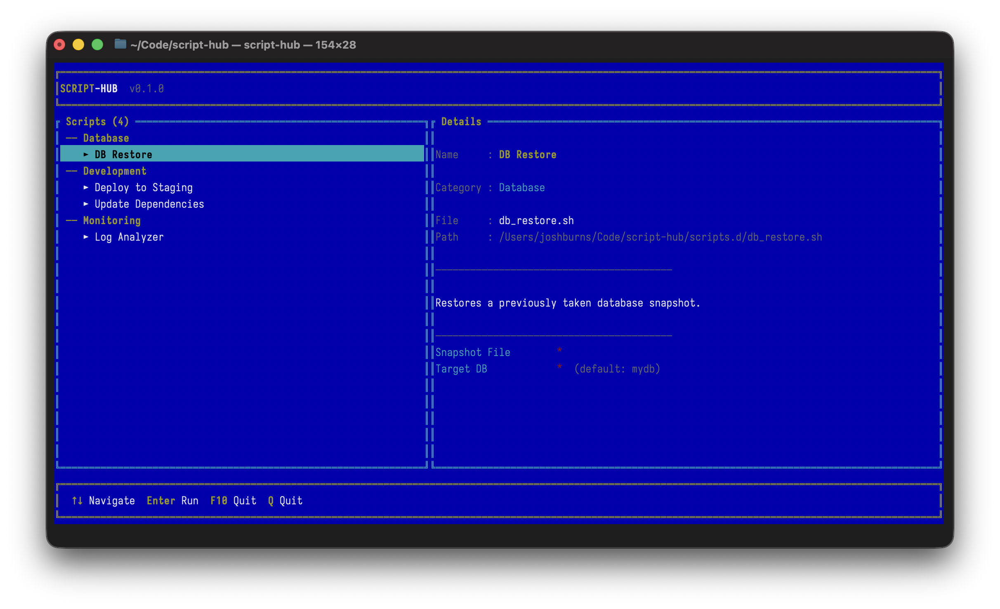
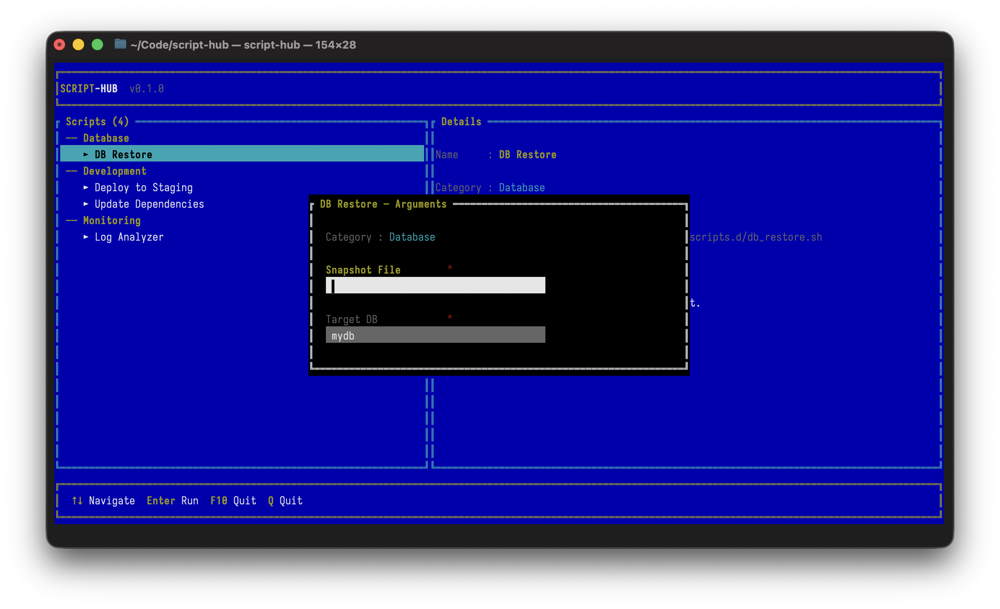

# Script Hub
An organiser, and launcher for your bash scripts

## What is it?
Script hub gives you a unified interface that allows you to organise bash scripts into categories, visually select what script you want to run, and even gives you a form to fill out the arguments.

